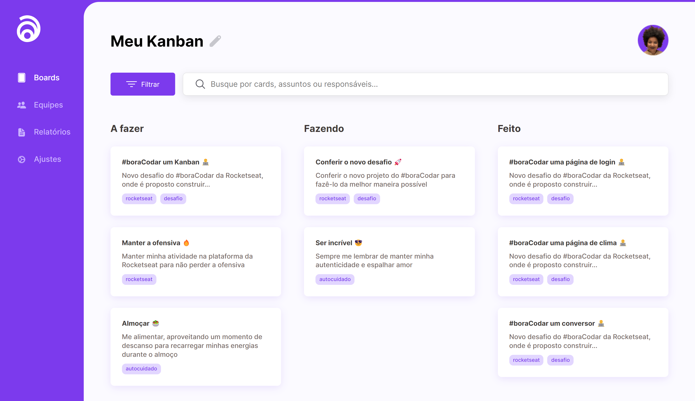

<h1 align="center"> Kanban - BoraCodar#12 </h1>

[Clique aqui para acessar](https://maik-emanoel.github.io/kanban/)

## 🚀 Tecnologias

Esse projeto foi desenvolvido com as seguintes tecnologias:

- HTML
- CSS
- JavaScript
- Git and GitHub

## 💻 Projeto

Este site é um Kanban, uma ferramenta de gerenciamento de projetos que ajuda as equipes a visualizar e acompanhar o progresso das tarefas em tempo real, baseado no sistema Kanban. 

Obs: Projeto construído a partir do layout proposto no desafio [#BoraCodar12](https://boracodar.dev/) realizado pela [Rocketseat](https://rocketseat.com.br).
Após o desenvolvimento do projeto inicial, adicionei novas features, tais quais:

- Layout responsivo (Adaptado para telas menores)
- Botão de filtro funcional
- Filtragem pelo título dos cards
- Efeitos hover nos botões
- Entre outras pequenas modificações.

## 🔖 Layout

Você pode visualizar o layout do projeto proposto através [DESSE LINK](https://www.figma.com/community/file/1220368226816658013). É necessário ter conta no [Figma](https://figma.com) para acessá-lo.